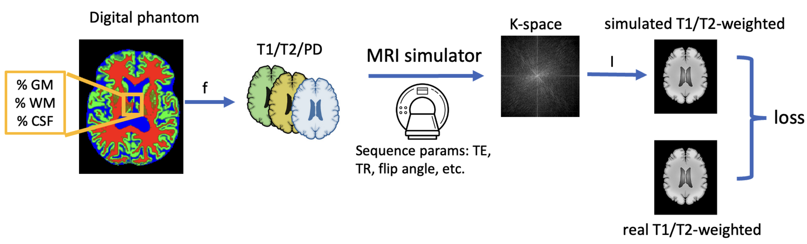
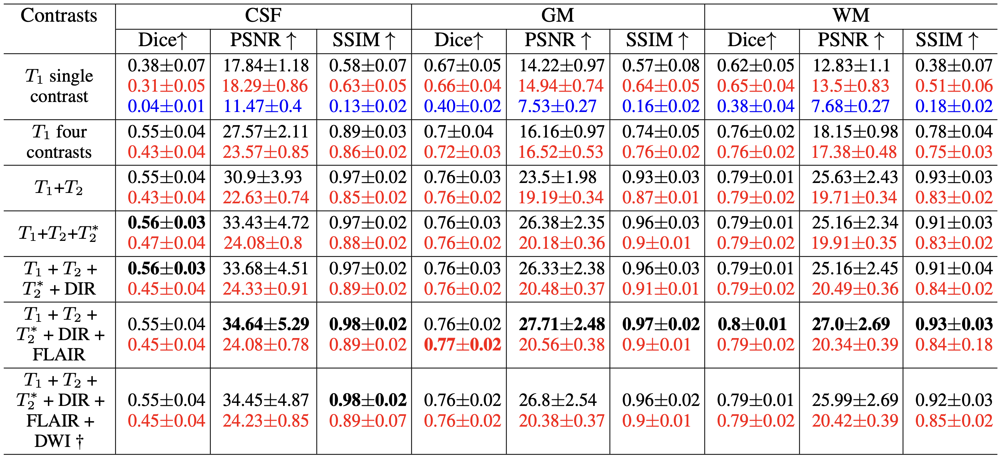
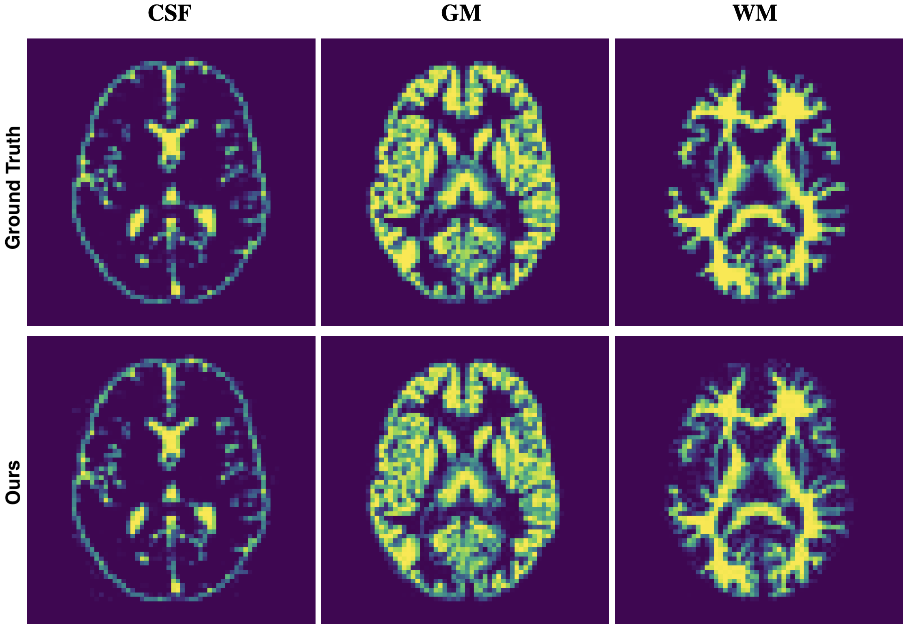

# BMapEst: Estimation of Brain Tissue Probability Maps using a Differentiable MRI Simulator

[[📖 Paper](https://arxiv.org/abs/2404.14739)]

## Introduction


In this paper, we introduce a novel framework leveraging the capabilities of [MR-zero](https://onlinelibrary.wiley.com/doi/epdf/10.1002/mrm.28727?src=getftr) to estimate the tissue probability maps of digital brain phantoms representing the CSF, GM, and WM. Unlike supervised learning, our framework does not need a-priori training pairs of inputs and outputs and can further estimate tissue probability maps for any arbitrary set of MRI sequences (e.g., T<sub>1</sub>-only, T<sub>1</sub>+T<sub>2</sub>,T<sub>2</sub>+T<sub>2</sub><sup>*</sup>+GRE, etc.) at any arbitrary echo times. Our contributions are:

1. We demonstrate the first method of estimating brain tissue probability maps using a differentiable MRI simulator that conducts forward inference to generate a T<sub>1</sub>/T<sub>2</sub>-weighted image by backpropagating a loss function to the brain tissue probability maps. Our approach is versatile, applicable to many different MRI sequences, and does not require learnable parameters.

2. We overcome the ill-posedness of probability maps estimation by using the inductive bias of the simulator and multiple T<sub>1</sub>/T<sub>2</sub> contrasts.

3. We validate our approach on BrainWeb’s 20 subjects with the popular Fast Low Angle Shot (FLASH) sequence variants and obtain state-of-the-art results compared to supervised deep learning and clustering methods.





## Installation

Python >= 3.10.12

```bash
git clone https://github.com/BioMedAI-UCSC/BMapEst.git
cd BMapEst
python3 -m venv bmapest
source bmapest/bin/activate
pip install torch==2.1.0 torchvision==0.16.0 torchaudio==2.1.0 --index-url https://download.pytorch.org/whl/cu121
pip install -r requirements.txt
```

Due to memory constraints, estimation of tissue probability maps can only happen in CPU for this release.

## Setup the BrainWeb dataset

Refer to the [dataset.md](utils/dataset.md) file to obtain the [BrainWeb](https://brainweb.bic.mni.mcgill.ca/brainweb/) slices.

## Estimation

You can find the commands for all the experiments that are described in the paper in the [subjects](subjects) directory. Run all the experiments for a subject as follows:

```bash
bash subjects/subject04.sh
```

## Cite BMapEst

If you find this code repository useful, please use the following BibTeX entry for citation.

```latex
@article{gupta2024bmapopt,
  title={BMapOpt: Optimization of Brain Tissue Probability Maps using a Differentiable MRI Simulator},
  author={Gupta, Utkarsh and Nikolakakis, Emmanouil and Zaiss, Moritz and Marinescu, Razvan},
  journal={arXiv preprint arXiv:2404.14739},
  year={2024}
}
```